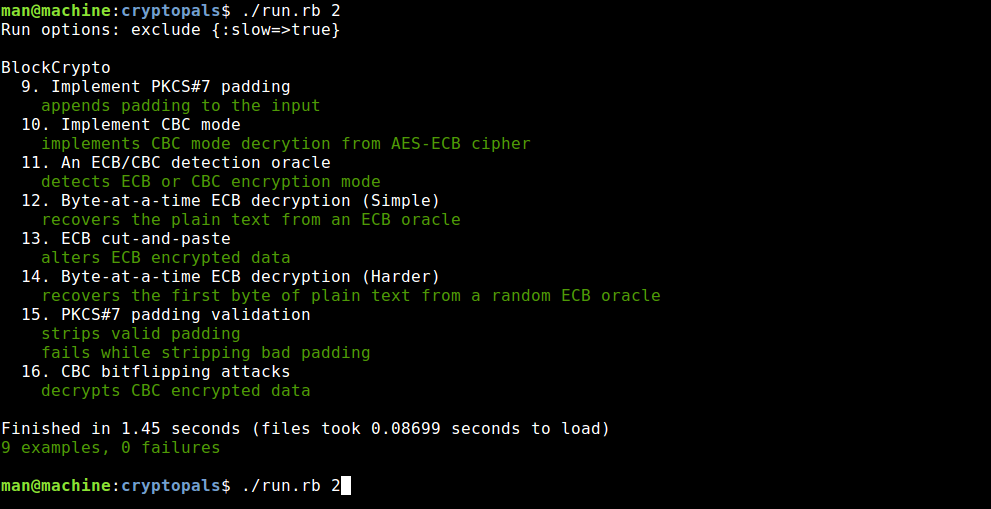

# Yet Another Cryptopals repo [](https://travis-ci.org/yoeo/cryptopals)
Hacking modern Cryptography / Cryptopals challenges answers in Ruby

## What is it?
It is a set of answers to Cryptopals cryptography challenges
http://cryptopals.com



This project implements attacks on actual cryptography, including:
 * cracking **AES encrypted messages** exploiting algorithm usage pitfalls
 * cloning Pseudo Random Number Generators to **predict random numbers**
 * breaking unsafe message signature and **sign malicious messages**
 * setting up **timing attacks**
 * and much much more**...**

Along with the challenges answers you will find rough implementation
of algorithms used in cryptography like SHA1, MD4, MT19937...

## How to use it?
Install the dependencies with ```bundle install``` and run it: ```./run.rb```

Usage:

```
run.rb [--help] [--slow] [SET_NUMBER]
  SET_NUMBER  : the number of the test to run, from 1 to 4
  --slow      : run slow tests, may take hours
  --help      : show help message
```

Examples:
```bash
./run.rb          # run all tests, except the slow ones
./run.rb --slow 2 # run only the slow tests of the Set-2
```

Go to http://cryptopals.com to view the tests,
read the code to understand the answers.

## Why?
Because it's fun to break things **let's break some crypto** :japanese_ogre:
